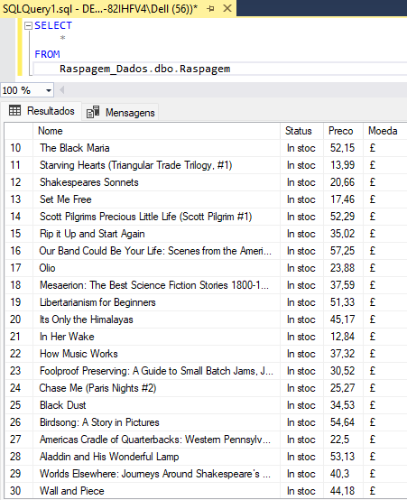

# Raspagem de Dados + Integração com Banco de Dados SQL

<h3><a href="/Raspagem de Dados + Ingregação SQL .ipynb">Passo a Passo</a></h3>

# Site onde os dados foram raspados

[All products | Books to Scrape - Sandbox](https://books.toscrape.com/index.html)

## Consulta ao banco de dados onde foi armazenado os valores coletados do site.

